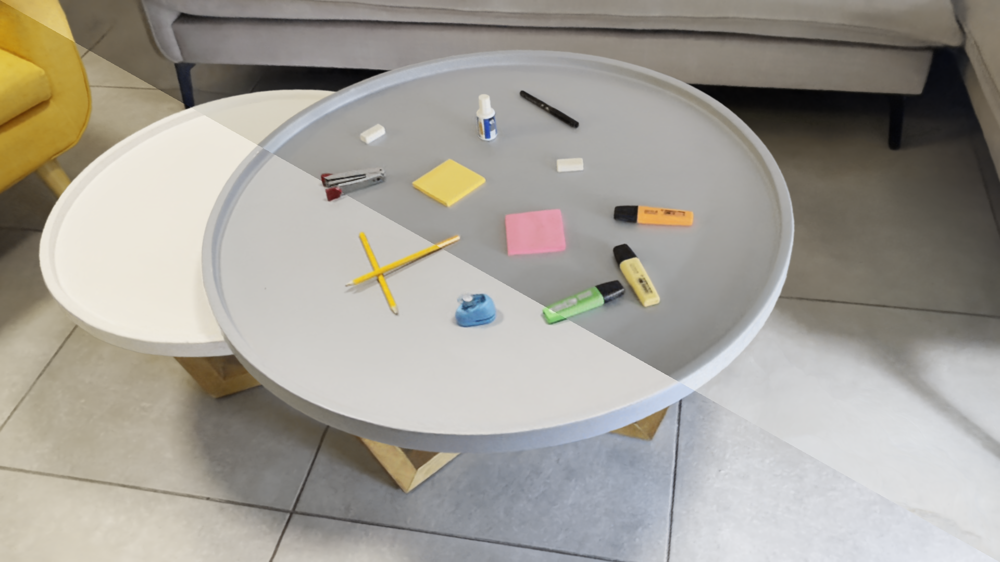

# VF-NeRF: Viewshed Field For Rigid NeRF Registration
## ECCV 2024
<a href="https://leosegre.github.io/VF_NeRF/"></a>
<a href="https://arxiv.org/abs/2404.03349"></a>

By [Leo Segre](https://scholar.google.co.il/citations?hl=iw&user=A7FWhoIAAAAJ) and [Shai Avidan](https://scholar.google.co.il/citations?hl=iw&user=hpItE1QAAAAJ)

This repo is the official implementation of "[VF-NeRF: Viewshed Field For Rigid NeRF Registration](https://arxiv.org/pdf/2404.03349.pdf)".

<p align="center">

</p>

## Citation
If you find this useful, please cite this work as follows:
```bibtex
@misc{segre2024vfnerf,
      title={VF-NeRF: Viewshed Fields for Rigid NeRF Registration}, 
      author={Leo Segre and Shai Avidan},
      year={2024},
      eprint={2404.03349},
      archivePrefix={arXiv},
      primaryClass={cs.CV}
}
```

# About

VF-NeRF is a method to register two NeRF scenes. We utilize Normalizing-flows to understand the scene and generate novel views and point-clouds.

## 1. Installation: Setup the environment

### Prerequisites

You must have an NVIDIA video card with CUDA installed on the system. This library has been tested with version 11.7 of CUDA. You can find more information about installing CUDA [here](https://docs.nvidia.com/cuda/cuda-quick-start-guide/index.html)

### Create environment

Nerfstudio requires `python >= 3.7`. We recommend using conda to manage dependencies. Make sure to install [Conda](https://docs.conda.io/en/latest/miniconda.html) before proceeding.

```bash
conda create --name vf_nerf -y python=3.8
conda activate vf_nerf
python -m pip install --upgrade pip
```

### Dependencies

Install pytorch with CUDA (this repo has been tested witt CUDA 11.7) and [tiny-cuda-nn](https://github.com/NVlabs/tiny-cuda-nn)

```bash
pip install torch==1.13.1 torchvision functorch --extra-index-url https://download.pytorch.org/whl/cu117
pip install ninja git+https://github.com/NVlabs/tiny-cuda-nn/#subdirectory=bindings/torch
```

### Installing vf_nerf (Based on [Nerfstudio](https://docs.nerf.studio/))

```bash
git clone https://github.com/leosegre/VF_NeRF.git
cd VF_NeRF
pip install --upgrade pip setuptools
pip install -e .
```

### Installing Normalizing-flows

```bash
cd normalizing-flows
pip install -e .
cd ..
```

## 2. Preparing your data
Assuming you have a video or a set of images, run COLMAP to get a valid transform.json
````bash
ns-process-data {video,images} --data {DATA_PATH} --output-dir {PROCESSED_DATA_DIR}
````

Once you have a valid transform.json and a set of images, use can split it into two sets manually or use our script
````bash
python scripts/split_transform_file.py {directory} {min_bound} {max_bound} {even_odd}
# For example
python scripts/split_transform_file.py data/trex 30 70 True
````
Alternativly split using k-means:
````bash
python scripts/split_transform_file_objaverse.py {directory}/
````


## 2. Register the two NeRFs

First you need to run VF-NeRF to create the two NeRFs, then you can run the registraion process. Use our script to create the NeRFs and register them. 
If you already have two pretrained VF-NeRFs you can run the registration procees by setting the timestamp of the pretrained NeRFs.
```bash

python reg_pipeline_pc.py {data_dir} {outputs_dir} {scene_names} {scene_types} {downscale_factor} {timestamp(optional)}
# For example
python reg_pipeline_pc.py data/ outputs/ trex 0_100_even_odd 2
```

### Generate Point Cloud fast using VF-NeRF

```bash
ns-export nf-pointcloud --help
```


# Built On
<a href="https://github.com/nerfstudio-project/nerfstudio">
<!-- pypi-strip -->
<picture>
    <source media="(prefers-color-scheme: dark)" srcset="https://docs.nerf.studio/_images/logo.png" />
<!-- /pypi-strip -->
    
<!-- pypi-strip -->
</picture>
<!-- /pypi-strip -->
</a>

- A collaboration friendly studio for NeRFs

